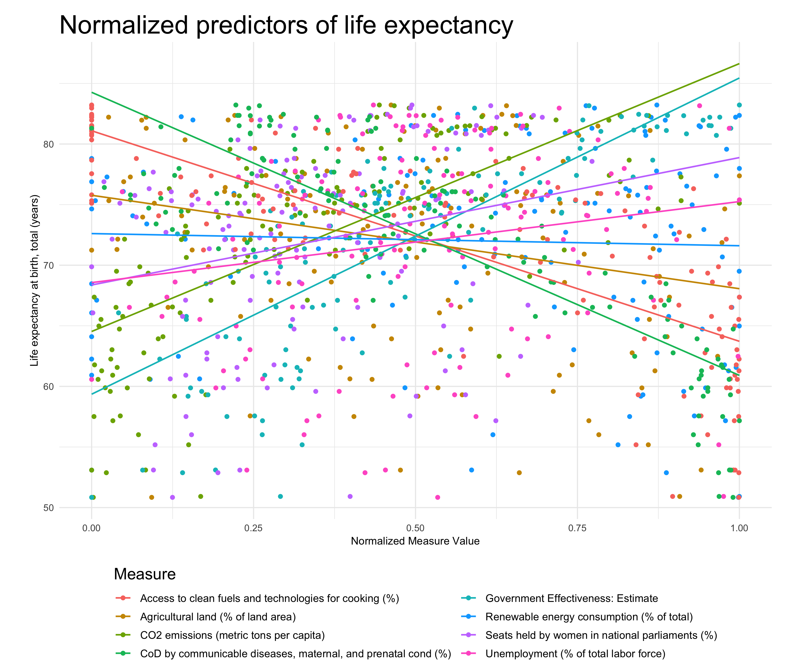

# Predicting life expectancy from sustainability measures

*R | Tidying data | Transforming data | Multilinear regression | Interactive graphing*

# Intro

The World Bank reports a massive amount of [Environment, Social, And Governance (ESG)](https://datacatalog.worldbank.org/dataset/environment-social-and-governance-data) data  for numerous countries and geographical regions. The World Bank's [sustainable development goals](https://datatopics.worldbank.org/world-development-indicators/wdi-and-the-sustainable-development-goals.html) aim to improve these measures in order to improve the well-being of populations.

For me, it is fascinating that this myriad of measures can have such a significant impact on the well-being of populations. How does one measure well-being? One rough proxy is lifespan. Obviously, factors such as clean water and good healthcare can affect lifespan; but we are discovering that even factors such as [intergenerational stress](https://epigeneticsandchromatin.biomedcentral.com/articles/10.1186/s13072-017-0145-1) can have an effect on lifespan. 

In this project, I explored the relationship between sustainable development indicators reported by the World Bank and life expectancy. I perform mutiliniear regression and create a model to predict country-wide mean life expectancy using variables reported in the ESG dataset.

# Usage

## To view project on RStudio:
- Clone this repo and run `setup.R` to install and attach the required packages
- Individual scripts in `scripts` directory
    - `import_data.R` imports & tidies data, selects variables for analysis, writes tidy data to .csv 
    - `transform_data.R` prepares data for regression
    - `predict_life_exp.R` creates the regression model to predict life expectancy
    - `viz.R` graphs

- `notebooks/WB_sustainability.rmd` run all the code in a notebook (produces .html output)

## To run the Jupyter Notebook in a conda environment:
- Create my R environment from the environment.yml by cloning the repo, stepping into this project directory in the terminal, and running `conda env create -f environment.yml`
- OR Install packages from inside the Jupter Notebook (running the first few cells) 
- `notebooks/WB_sustainability.ipynb` run all the code in juypter notebook through the R kernel (which is part of the .yml env file)


# Findings

The final model significantly predicts life expectancy (F(8,120) = 130.7, p < 0.01) and accounts for 89% of variance in life expectancy.

The following predictors had a main effects on life expectancy:
```
renewable electricity output (beta=-0.05, p=0.05)
agricultural land (beta=0.08, p=0.02)
CO2 emissions (beta=-0.22, p=<0.01)
government effectiveness score (beta=0.41, p<0.01)
proportion of seats held by women (beta=0.011, p=0.02)
unemployment rate (beta=-0.011, p<0.01)
cause of death by communicabel diseases, and maternal and prenatal nutrition conditions (beta=0.55, p<0.01)
```

Some of these coefficients relate the predictor to life expectancy in a linear manner, while others modify the relationship between life expectancy and the square root of the predictor or the square root of the negative of the predictor. 



